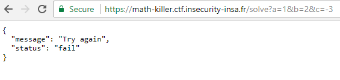

# Category: Misc/Math

## Problem:
**Description:**
```
95% of ppl can't solve this equation!!!

If ur smart enough, send ur solution to https://math-killer.ctf.insecurity-insa.fr/solve?a=...&b=...&c=...
```


Misc is a broad CTF category that does not map well to any particular job role in the security. You may have to solve math, play games, code script tools or write algorithms.

Forensics challenges can include file format analysis, steganography, memory dump analysis, or network packet capture analysis. You have to examine and process a hidden piece of information out of static data files.


## Solution:
According to the image, the equation to be solved:
```
    a/(b+c) + b/(a+c) + c/(a+b) = 6
```
By submit some input like a=1&b=2&c=3.0, I figure out that a, b, c must be integers (both positives and negatives accepted):




Let's solve the equation. I tried to set a = 0:
```
            b/c + c/b = 6
    <=>     b = (3+2*sqrt(2))*c
        or  b = (3-2*sqrt(2))*c
```
=> Cannot get integer roots.

I also tried to solve the origin equation with a unknown and b, c coefficients, and got a very complex cubic equation :( => failed

Let's try to transform the equation. Let x = b+c, y = a+c, z = a+b => x, y, z are non-zero integers.
```
    =>  a = (y+z-x)/2, b = (x+z-y)/2, c = (x+y-z)/2 (=> x, y, z must be all odd or even)
    
            a/(b+c) + b/(a+c) + c/(a+b) = 6
    <=>     (y+z-x)/(2*x) + (x+z-y)/(2*y) + (x+y-z)/(2*z) = 6 (*)
```
Let z unknown and x, y coefficients, we transform (*) into quaratic equation, and get:
```
    Delta = (x^2+y^2-15*x*y)^2 - 4*(x+y)*(b^2*c+c^2*b)

    z = (15*x*y - x^2 - y^2 + sqrt(Delta))/2/(x+y)
or  z = (15*x*y - x^2 - y^2 - sqrt(Delta))/2/(x+y)
```
Then, to find x, y such that z is integer, I used excel to get a table of z values in some x, y ranges. To learn how to get the table, watch https://www.youtube.com/watch?v=jUoo_7KQfO0.


From the table, we get some integer roots. With (x, y, z) = (6, 4, 30), we get (a, b, c) = (14, 16, -10)
Submit and we get the flag:
**INSA{try_positive_solutions_now}**

