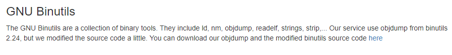

# Category: Pwnable

## Problem:
Exploit a web service hosting objdump functions. 
 
The objdump is from binutils 2.24, and it is modified so that it is pwnable. The source code, binary objdump file and configuring info are provided: https://drive.google.com/drive/folders/0B943jnA--r3YY0pmR0ZLUDIzWDQ.  
 
To find out where the source code was modified, I download the original source and use diff: 
 
The modified file is bfd/peicode.h. The condition **internal_f.f_opthdr > bfd_coff_aoutsz (abfd)** is commented out. So the sizeof(optional hdr) can be as large as possible. On the other hand, the modidied code is compiled with option **-fno-stack-protector** => The challenge author want us to exploit a stack buffer overflow, triggered from the arbitrary size of PE file optional header. The last entries of optional header is DataDirectory array. 
 
I crafted a PE file with large size DataDirectory arry => triggered BOF with arbitrary value at return address on stack.
## Solution:

